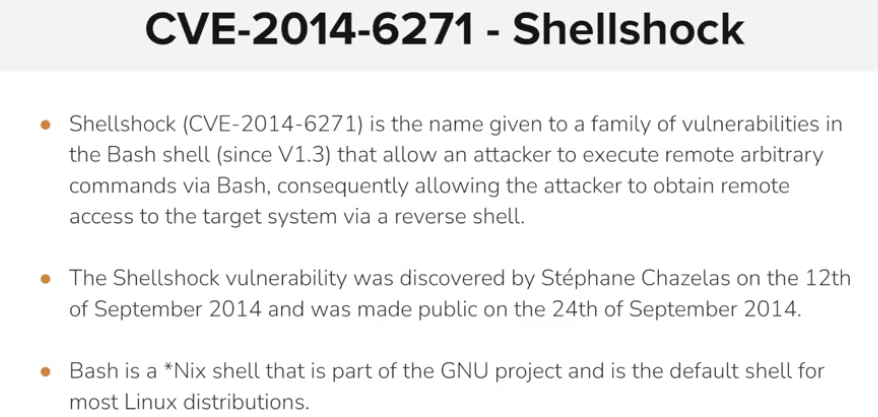
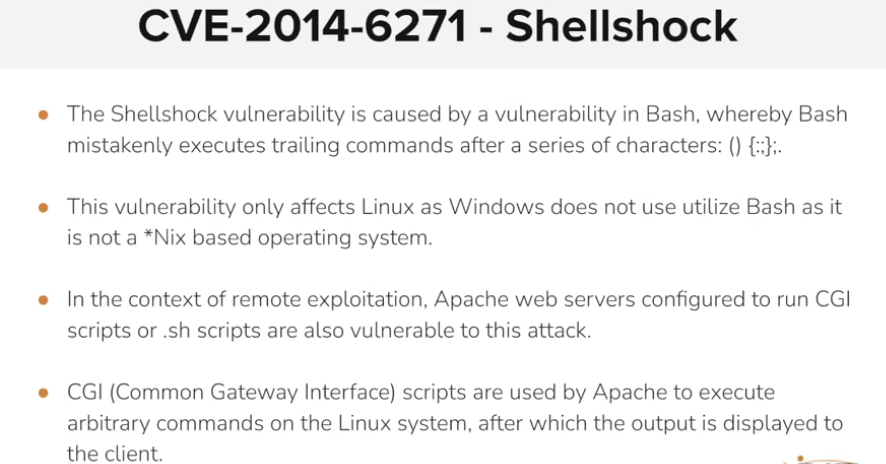
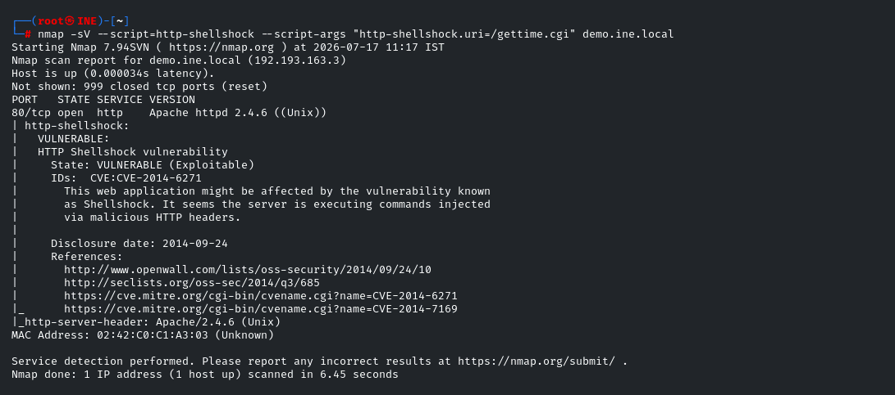
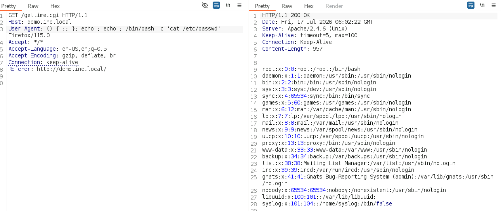
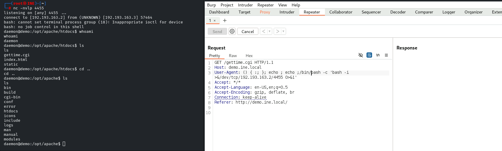
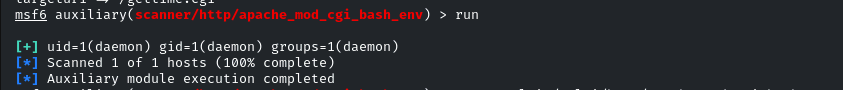

**A [Common Gateway Interface (CGI)](https://www.w3.org/CGI/) is used to help a web server render dynamic pages and create a customized response for the user making a request via a web application.**

&nbsp;

**if any apache server  is using cgi script we can use it to exploit the server**

**we can use nmap script to confirm if the server is vulnerable or not  **  

**Using burpsuite to exploit the vulnerability**

****

&nbsp;

obtaining a reverse shell on the target

&nbsp;

using msf modules to scan assess and exploit the target

&nbsp;

**Which HTTP header field is commonly modified to exploit the Shellshock vulnerability: User-Agent**

**What characteristic of Bash specifically leads to the Shellshock vulnerability: faulty environment variable function declaration**

**What does the exploitation of the Shellshock vulnerability require in the context of an Apache server : Utilizing CGI scripts or shell scripts**

**What type of attack is enabled by the Shellshock vulnerability? : remote arbitrary command execution**

**which shell was primarily affected by the shellshock vulnerability : Bash**