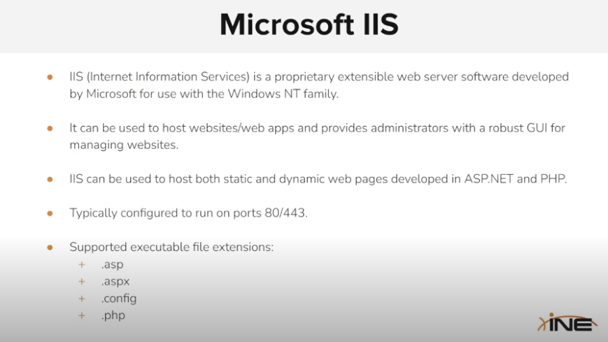
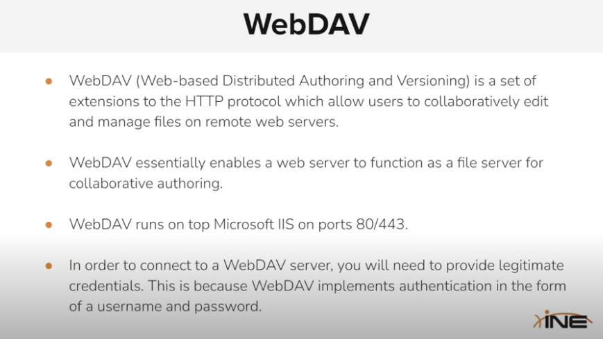
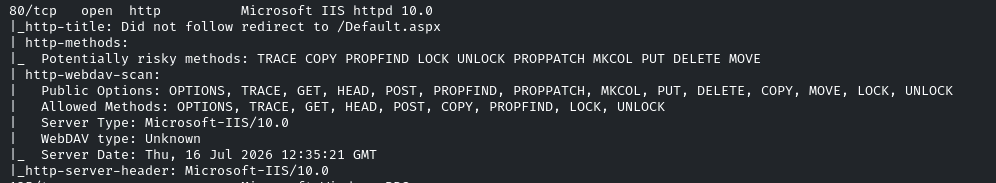
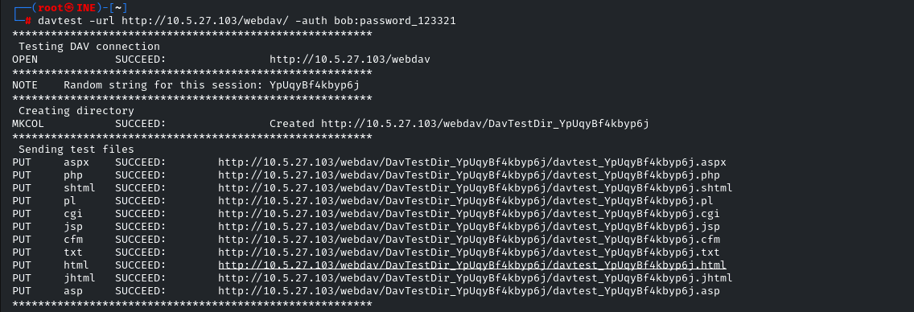
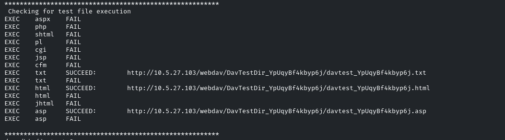
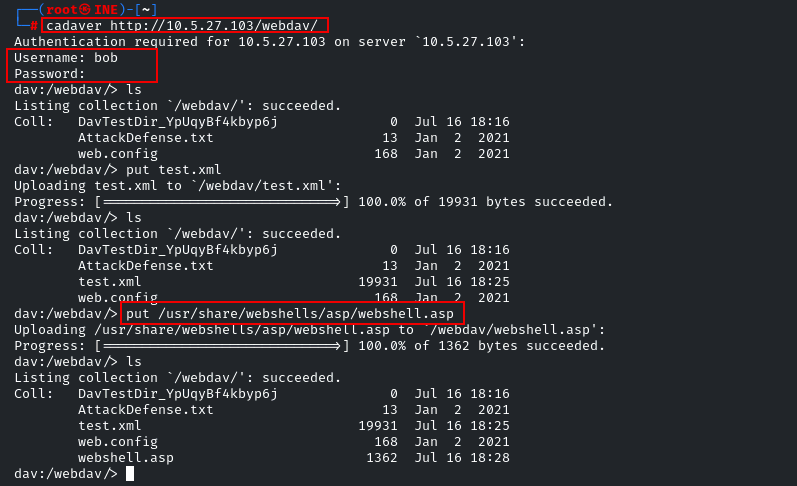
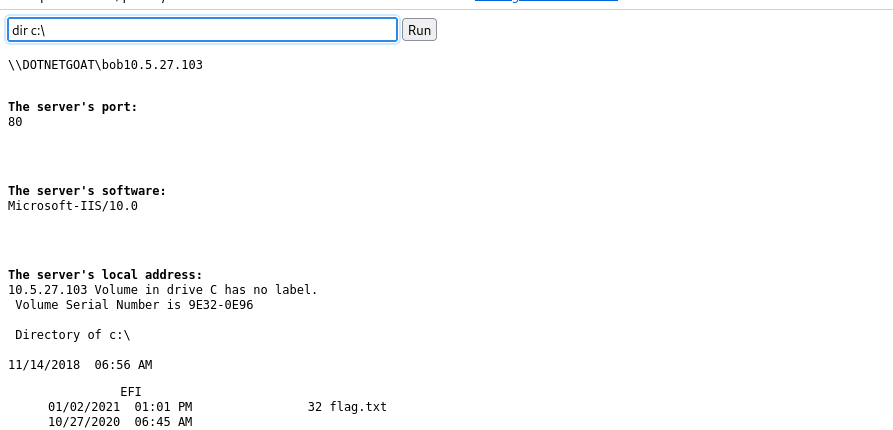
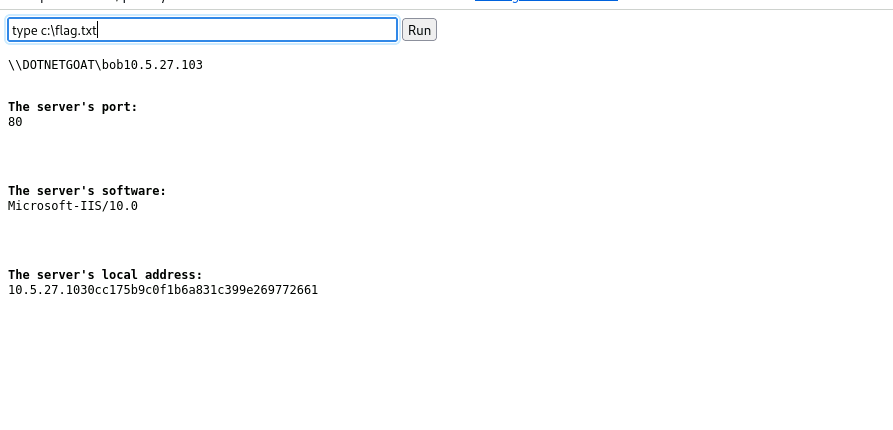

**A webDAV runs on top of a IIS or apache server to manage files on remote web servers**

&nbsp;

**Identify the port that is running webdav**

**use the davtest tool to find what type of file upload and execution is allowed on the webdav directory**

&nbsp;

**we can use the tool cadaver to upload files on the webdav directory and obtain a webshell**

&nbsp;

