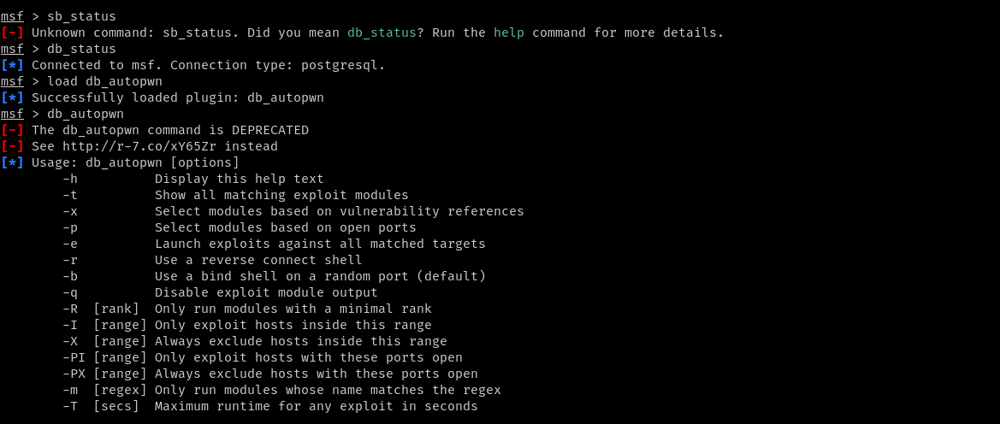
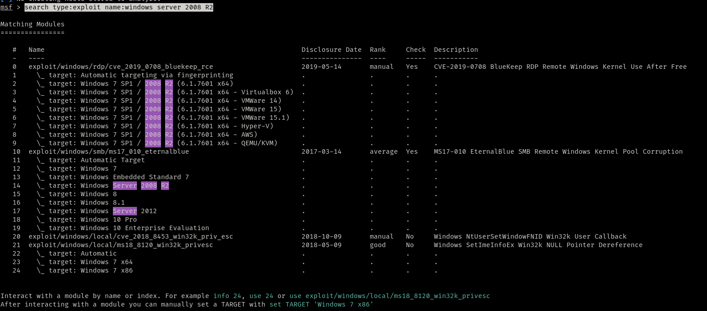
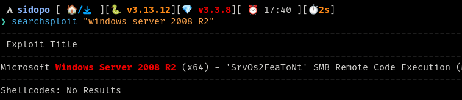

connects with the psotgresql and finds all the possible exploits based on the ports and services

**What does the auxiliary module for SMB -MS17 -010 check : Vulnerability to the EternalBlue exploit**

**In vulnerability scanning, which step is crucial before using exploit modules : Confirming the target's service version information**

**What is the primary purpose of vulnerability scanning in the context of the Metasploit framework : To identify and exploit Metasploit exploit modules.**

**Which command can be used to perform an Nmap scan and import results directly into the Metasploit database : db-nmap**

**Which Metasploit plugin assists in identifying exploit modules based on currently open ports : db_autopwn**