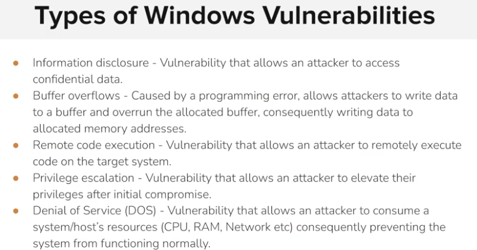
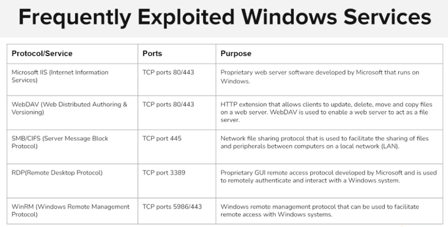

**What does WinRM stand for and what port does it typically use with SSL?: Windows Remote Management, port 5986**

**WebDAV is mainly used : to Update, delete, move, and copy files on a web server**

**Which native Windows service runs on TCP port 80 or port 443 if SSL is configured : IIS (internet informations services)**

&nbsp;**the RDP service be never enabled by default on a Windows system**

**What is the primary function of the SMB protocol in Windows : To share files and peripherals over a network**

**Which protocol allows for graphical user interface remote access on Windows systems: RDP**