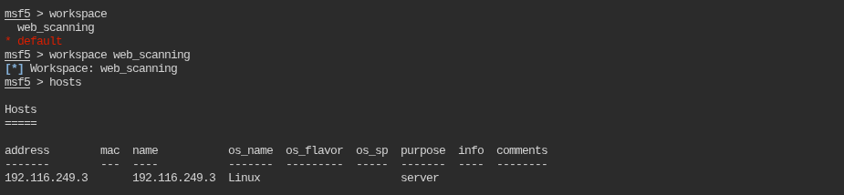
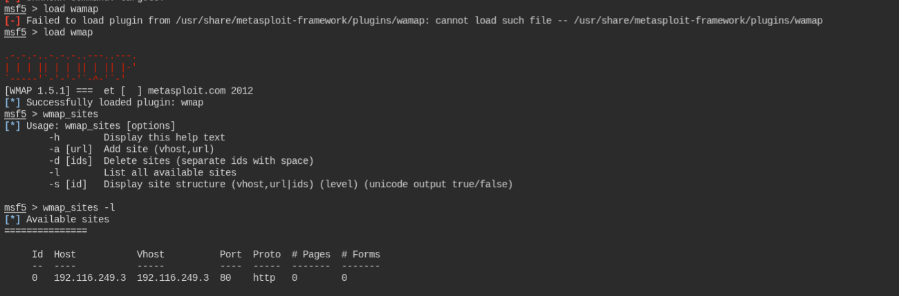
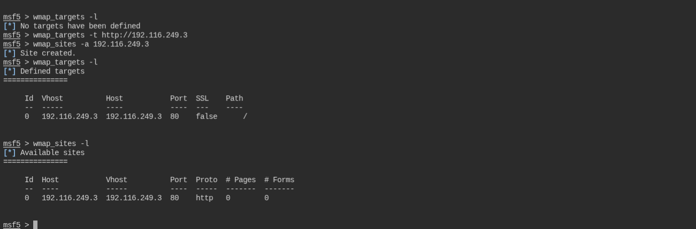
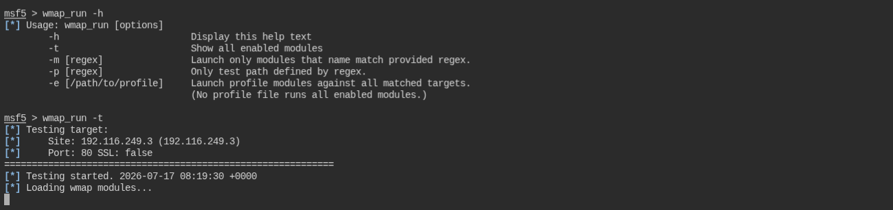
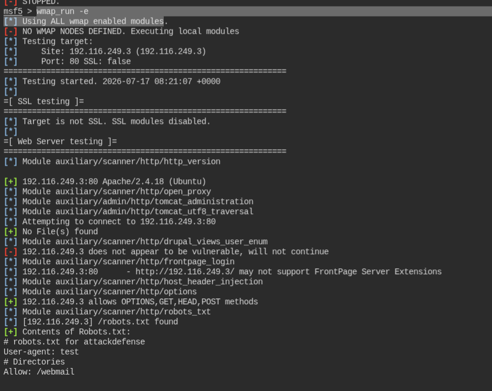
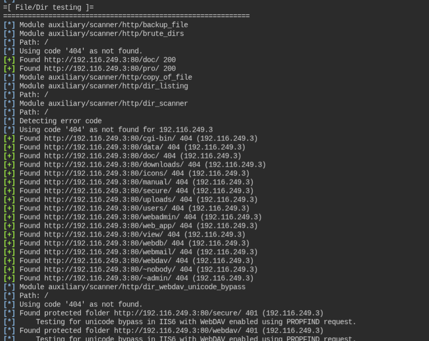

**setting up msfconsole**

**Loading wmap module**

**Setting up targets and sites on wmap**

**show all modules that will be tested against the target**

&nbsp;

**And finally run all modules against the target `wmap_run -e`**

Findings 

