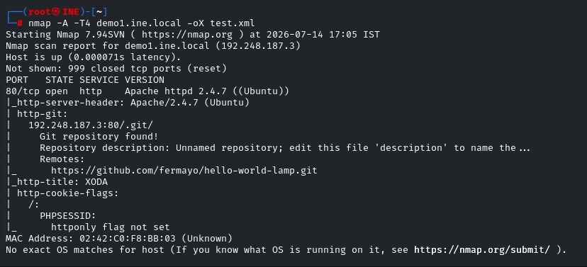
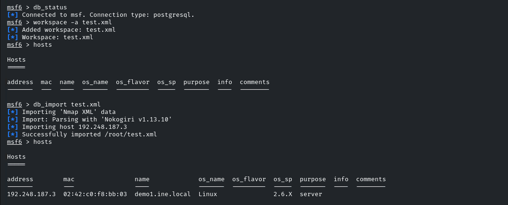

first step is to export the nmap results to a xml file

we need to start the postgresql database to import the scan into msf

`service postgresql start`

now we can use msfconsole to import the xml file

&nbsp;

&nbsp;