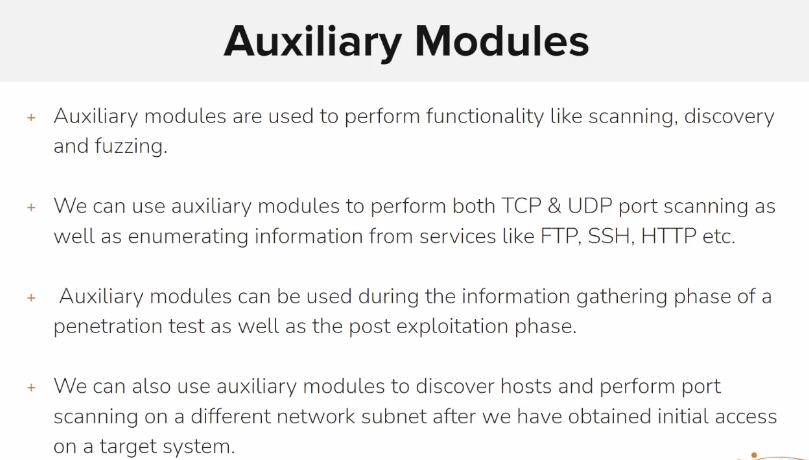
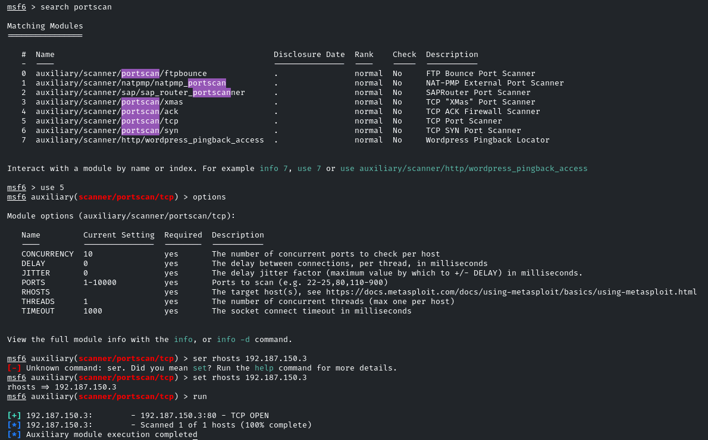
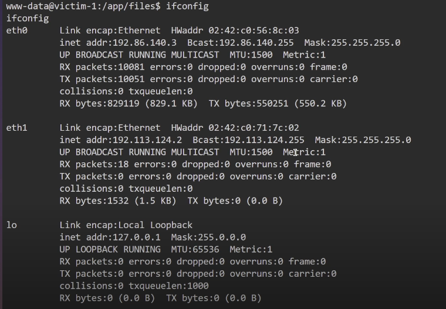
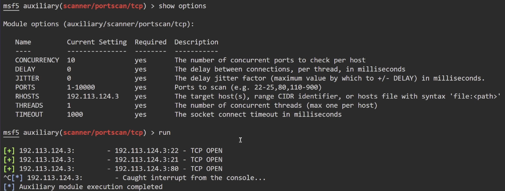

we can use portscan module of the msf to identify the open ports on a system

**After obtaining a meterpreter shell we can use that to obtain the IP of other devices on the network**

****

**the eth1 interface was used by us ,and the eth0 interface was not known to us .so we can use the victim1 ip to route traffic into the unknown network**

**we scan the victim2 IP for the open ports**  

****

&nbsp;