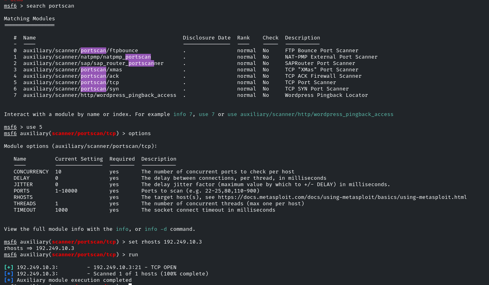
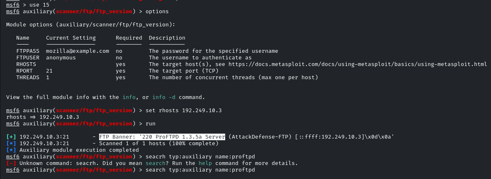
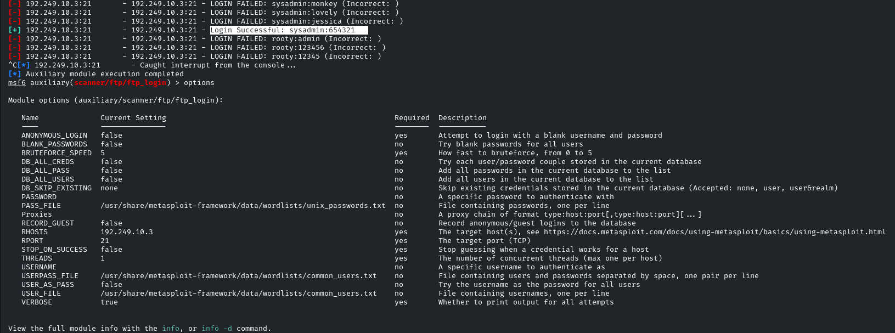
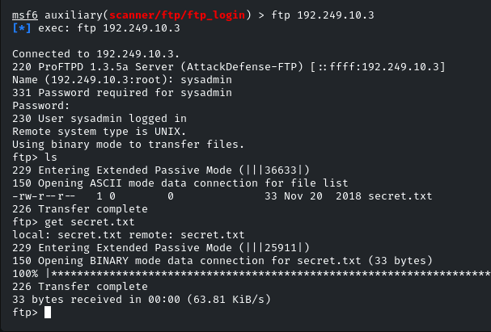

**FTP Enumeration**  
\> FTP (File Transfer Protocol) is a protocol that uses TCP port 21 and is used to facilitate file sharing between a server and client/clients.  
\> It is also frequently used as a means of transferring files to and from the directory of a web server.  
\> We can use multiple auxiliary modules to enumerate information as well as perform brute-force attacks on targets running an FTP server.  
\> FTP authentication utilizes a username and password combination, however, in some cases an improperly configured FTP server can be logged into  
anonymously.

**we can search for version module of msf to identify he version of ftp**

****

**we can also use a ftp_login module to try logging to the server using user and password files**

****

**once we have valid credentials for the username and password we can login to the ftp**

**192.249.10.3**