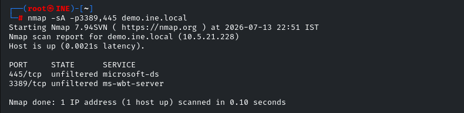
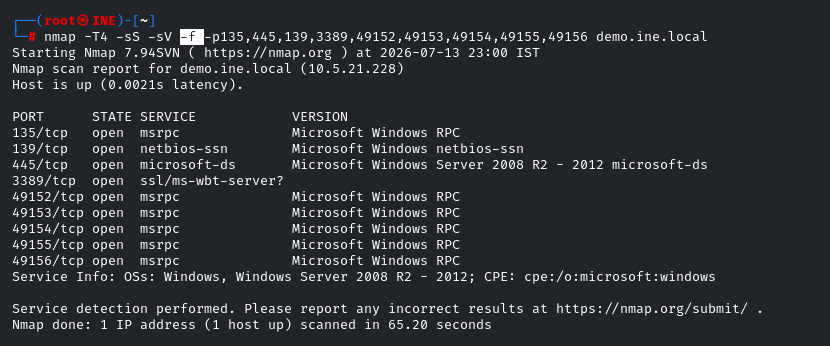
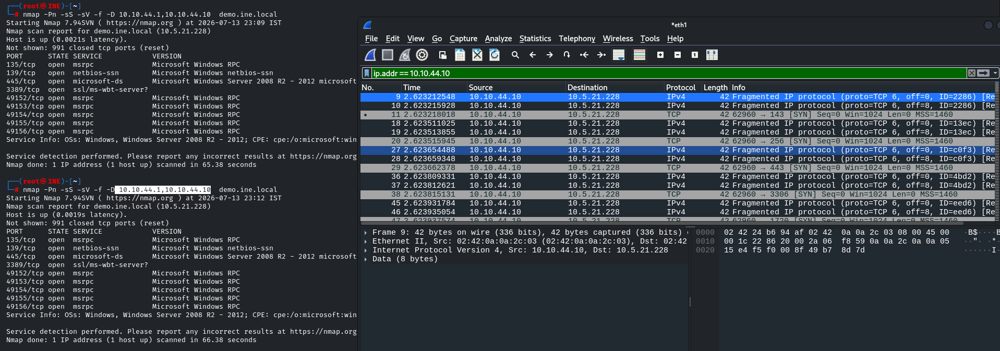
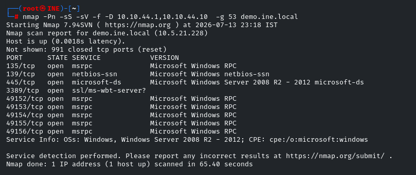

**detect the presence on firewall using -sA**

****

**unfiltered port confirms that their is no firewall at the host**

**filtered ports may tells us that their is a firewall sitting on the host**

&nbsp;

# **IDS evasion**

**with -f option the packets are fragmented during transmission at the network layer.**

**can use --mtu to set custom minimum size of the fragment length**

****

**Bypass any manual detection by using decoy ip's (using randomm IP's)**

****

**The scan also be bypassed by using a well known port like 53 ,that tell the network a DNS request might be coming from a router(by using the gateway IP)**

****