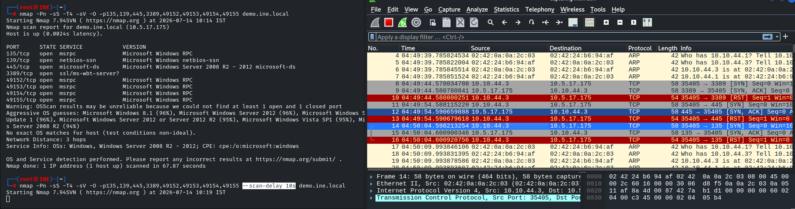
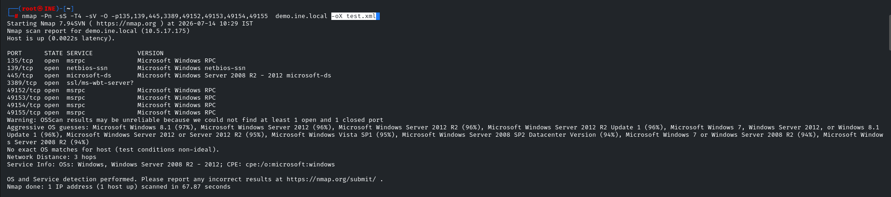
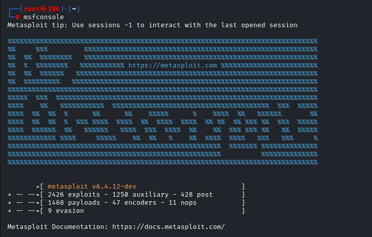
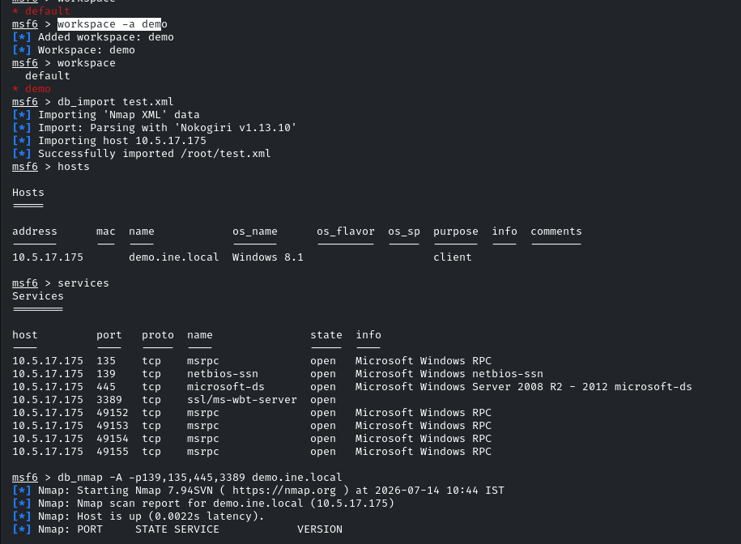

**Timing and performance**

**Timing option scan  **\-T paranoid|sneaky|polite|normal|aggressive|insane ,T0T1,T2,T3,T4,T5****

**T0-1 are mostly use for firewall and IDS evasion**

**Using scan delay option to delay packet transmitting**

****

**Saving the text results into xml formats that can be used by msf for further enumeration**

****

