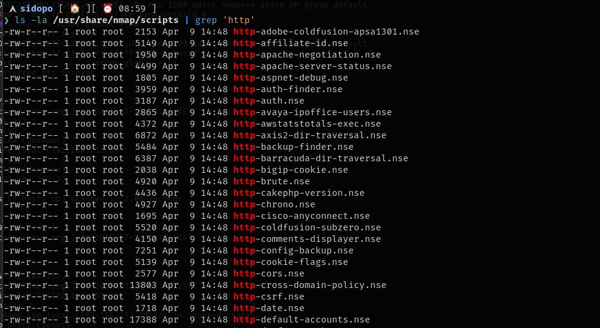
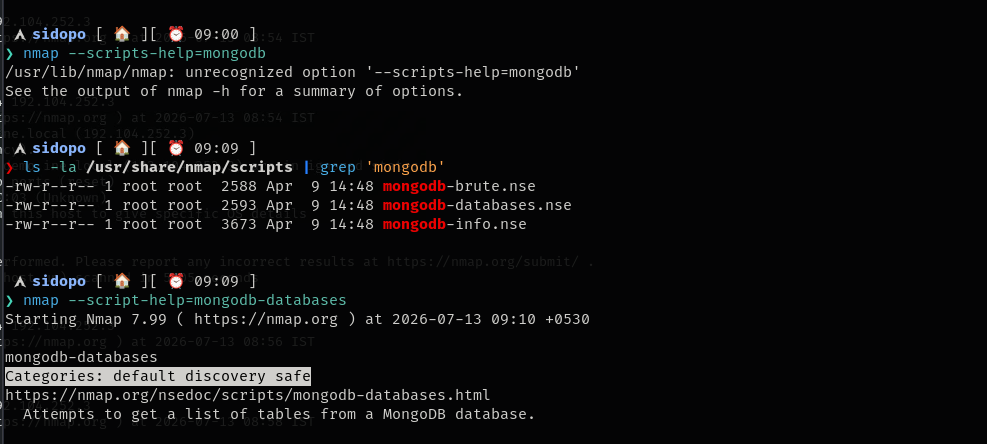

The **Nmap Scripting Engine (NSE)** is one of Nmap's most powerful features. It allows Nmap to **run Lua scripts** to perform tasks beyond basic port scanning, such as service detection, vulnerability checks, information gathering, and even limited exploitation

various scripts can be found at this location

&nbsp;

### to check whether a script is safe to run or not.

