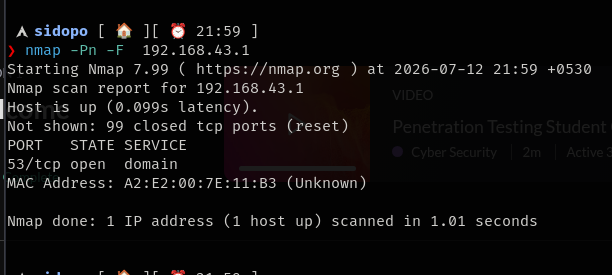
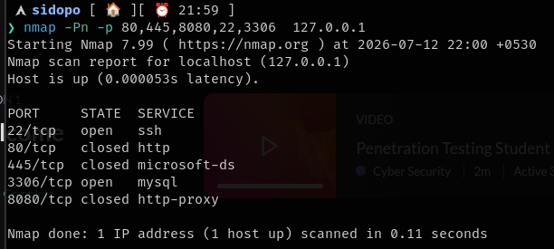
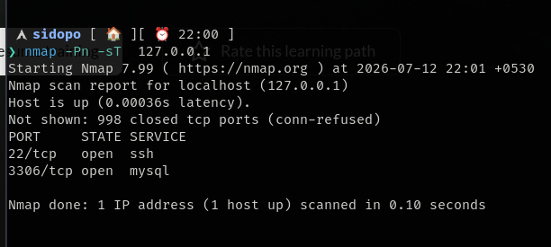
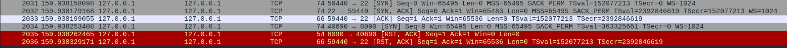
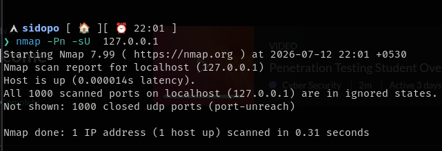
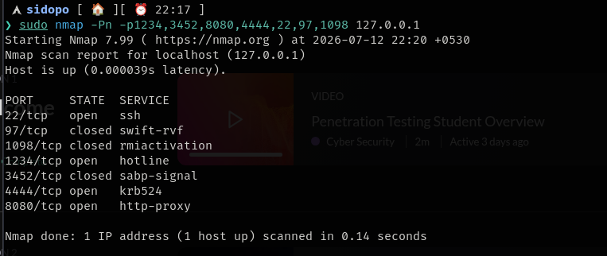
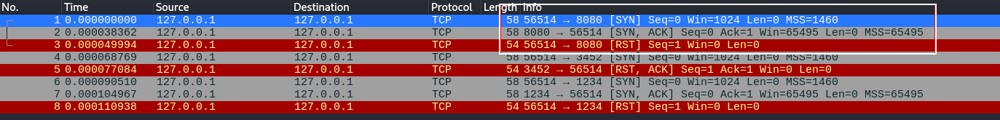

## no ping option (-Pn) consider the host as alive and scan most common 1000 ports (unless specified) must used scan while scanning a single target if -Pn is not specified it again scan for host discovery using ICMP packets 

fast scan `nmap -Pn -F <target>`

specific port scan `nmap -Pn -p 80,445`

TCP conect scan:- completes a 3 way handshake connection

&nbsp;`nmap -Pn -sT <target>`

UDP port scan `nmap -Pn -sU <target>`

### ==TCP SYN scan/Stealth scan/half-open scan(automatically runs when running through root privilages)==

### In  a SYN scan the nmap send s SYN packet to specific ports and waits  for the ports to reply with SYN-ACK if the host sends a SYN-ACK it means the prot is open ,when nmap receives a SYN-ACk packet it terminates the handshake by sending a RST packet .The process can be seen clearly in the below image.

### A RST confirms that the port is actually closed,if it does not receives anything from host that means may be a firewall is hiding behind the host.because the firewall may be filtering the RST packets passing through the it from a host.

&nbsp;

&nbsp;