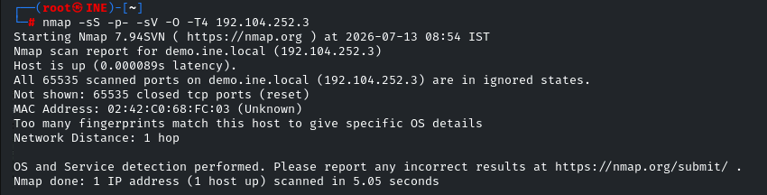
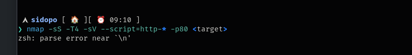
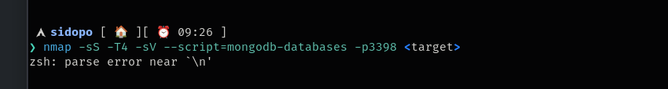
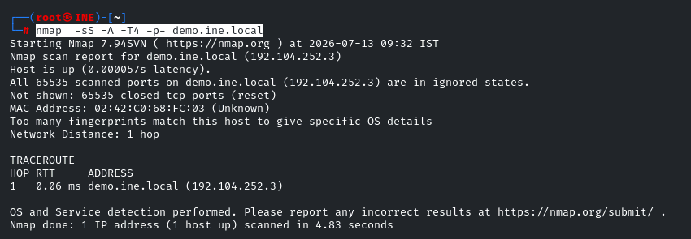
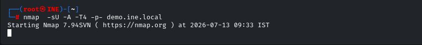

==**with nmap -sS -p- &lt;target&gt; ,The `-sS` option is a TCP-only scan because it relies on the TCP three-way handshake (SYN, SYN-ACK, ACK). UDP has no handshake, so `-sS` cannot be used for ports that running UDP services**==

==**if a system is running a UDP service on a common port it willl be easily bypassed with the above command to identify the udp ports we have to specify -sU option ,Instead, Nmap sends a UDP datagram to each port and interprets the response.**==

&nbsp;

**running all http scripts on a taget with port 80 service detection and** **stealth scan**

==****==

&nbsp;

==**scan all tcp ports using SYN and**==

==****==

&nbsp;

==**scan all ports using UDP packets,,if a service is runnning on a udp port it will be not shown using -sS option**==

==****==