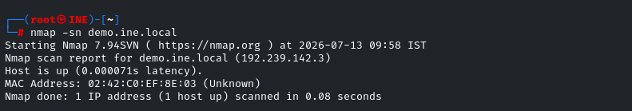
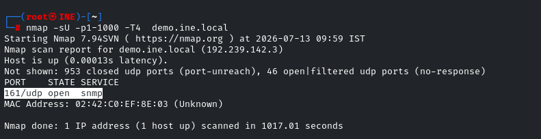
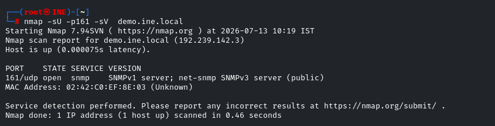
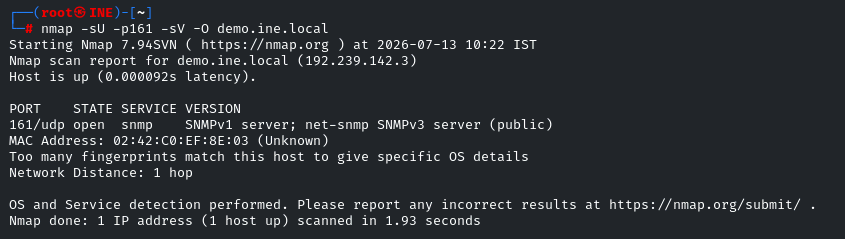
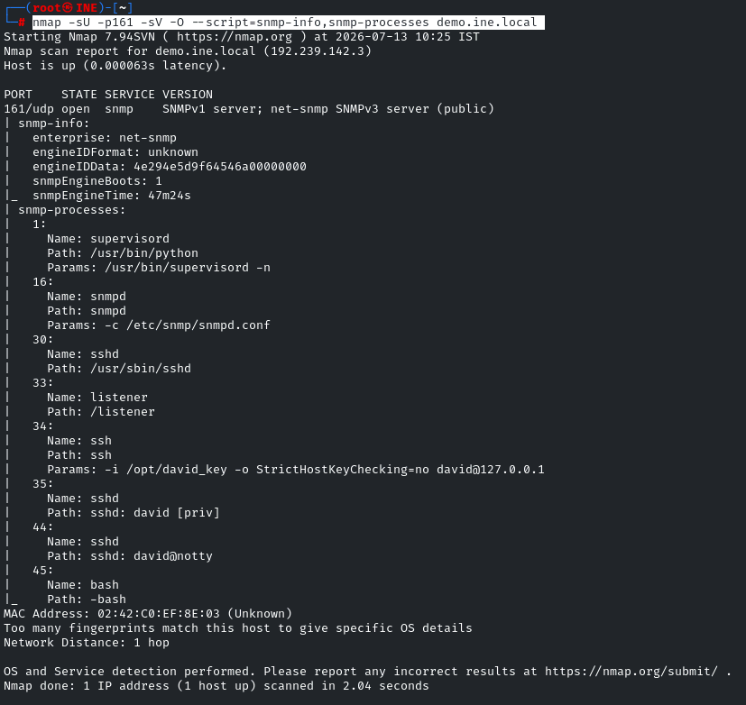
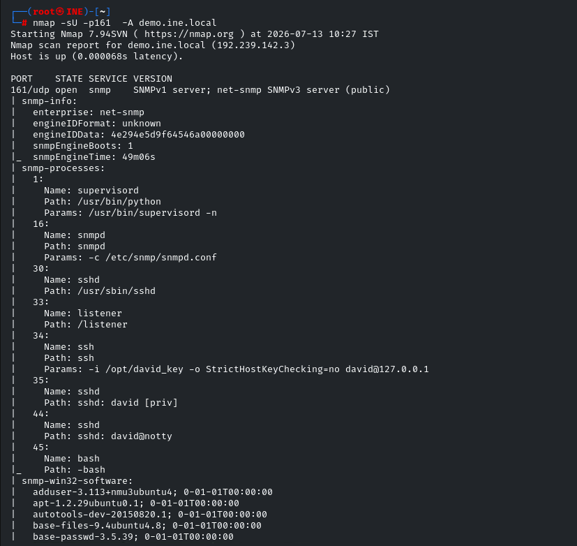

**host discovery**

****

**port discovery**

****

**service version detection**

****

**OS detection**

****

**service information detection using NSE**

****

&nbsp;

**Aggressive scan using -A option**

****