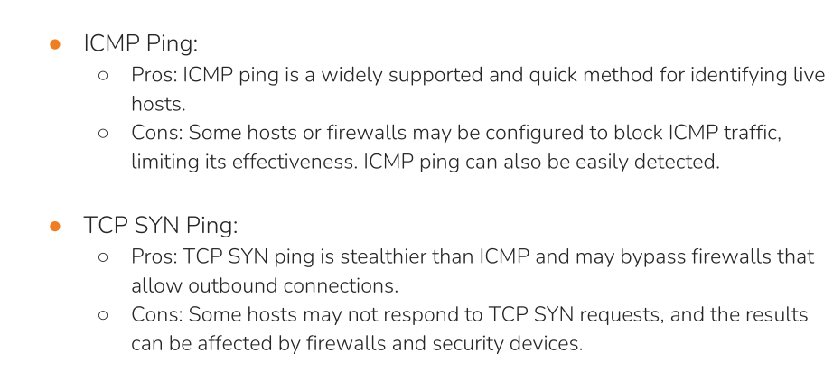
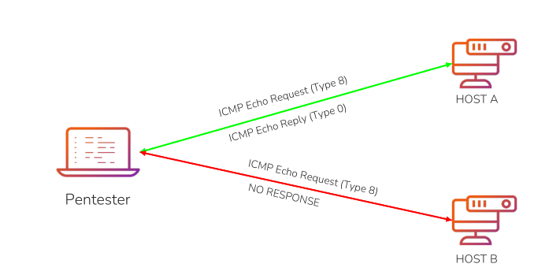

### functions of network mapper

- **host discovery** :-discovers lie host on the network using various techniques such as icmp request ,tcp/udp requests.
- **port scanning** :- it runs port scanning on networks to identify any open ports .
- **service version detection** :- nmap detects service version running on the ports ,this helps in identifying the attack surface and potential vulnerabilities associated with the specific versions.
- **OS fingerprinting** :- identifies the the operating systems of the host based on the characteristics shown during scanning process.

&nbsp;

### host discovery techniques

● **Ping Sweeps (ICMP Echo Requests)**: Sending ICMP Echo Requests (**ping**) to a range of IP addresses to identify live hosts. This is a quick and commonly used method.  
● **ARP Scanning**: Using Address Resolution Protocol (**ARP**) requests to identify hosts on a local network. ARP scanning is effective in discovering hosts within the same broadcast domain. ARP scanning is generally used in local network to identify live host.  
**● TCP SYN Ping (Half-Open Scan)**: Sending TCP SYN packets to a specific port (often port 80) to check if a host is alive. If the host is alive, it responds with a TCP SYN-ACK. This technique is stealthier than ICMP ping.

### Ping Sweep

- A ping command is used to identify live host on a network or internet using icmp packets .==windows by default blocks these icmp packets.==
    
- ● Ping sweeps work by sending one or more specially crafted ICMP  
    packets (Type 8 - echo request) to a host.  
    ● If the destination host replies with an ICMP echo reply (Type 0) packet,  
    then the host is alive/online.
    
- ICMP is a transport layer protocol
    
- ==In ping sweeping, the purpose of adjusting the Time To Live (TTL) value in ICMP packets is to limit the number of hops.==
    

&nbsp;

