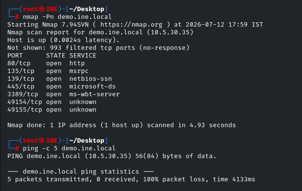
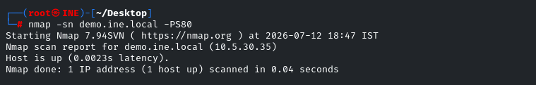
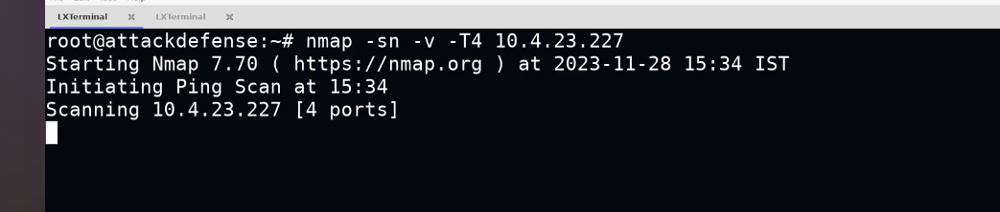
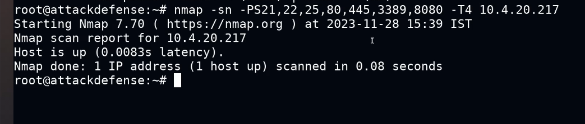

### nmap host discovery for a windows host

in the below example the host is blocking icmp echo resquest -which specifies that the host might be a winodows machine or a dead host.

after using nmap we come to that the host is actually a windows machine.

### \*\*whenever you scan your network for active host the nmap -sn options uses ARP packets to discover the host on the network and not ICMP which are supposed to be used.\*\* and can be overwrite by using the option "--send-ip " which sends the ICMP packets.

&nbsp;

### \-sn option is commonly used for host discovery and sends ICMP(but can also sends SYN ACK packets ) Echo Request packets to determine the status of a host

### a better way to discover if a host is alive or not ,using -PS syn ping packet on port 80 which overwrites the -sn option

### ==A ping scan is must before a port scan  to improve the efficiency of the scan  using -sn will be much beneficial while scanning more number of IP's==

### purpose of the "-PE" option in Nmap's host discovery scans:- To perform a ping sweep using ICMP Echo Request(forces to send only ICMP packets)

### methodology for  efficient  host discovery

### scanning a whole network with this option may save a lot time with the most common TCP/UDP ports

&nbsp;

&nbsp;