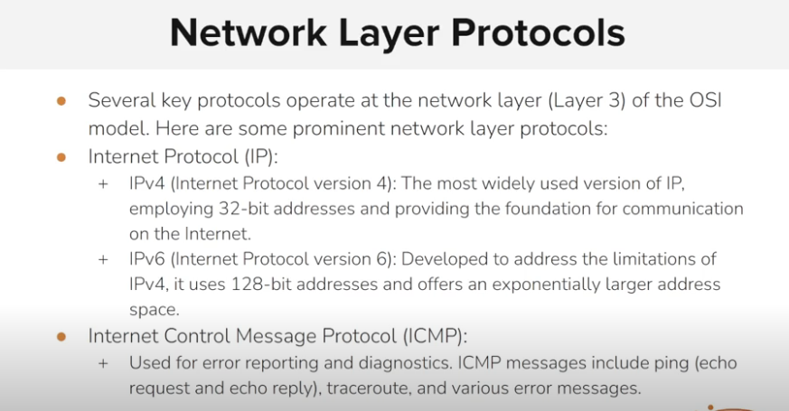
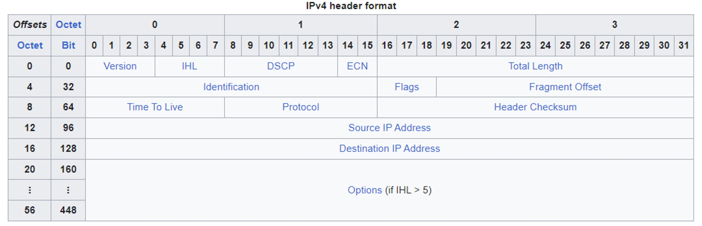
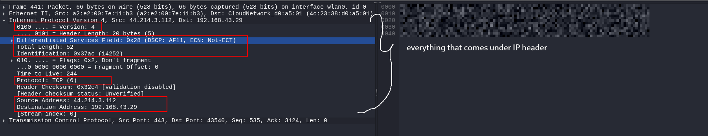
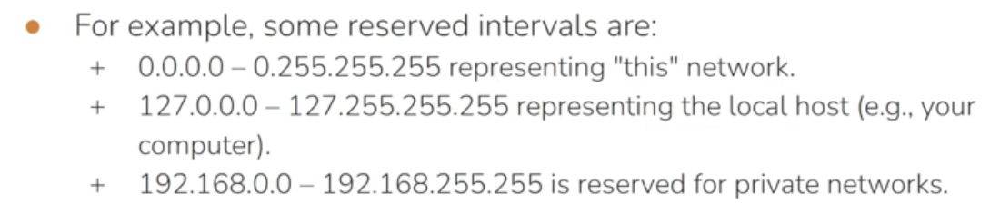
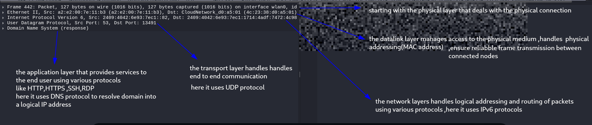
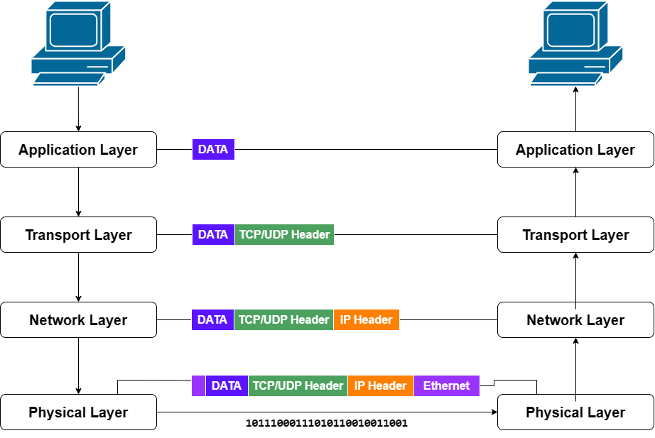

### The network layer

- the network layer is responsible for logical addressing,packet forwarding and routing across devices.
- its primary goal is to determine the optimal path from source to destination .

### various protocols comes under network layer and on of the important protocol is IP protocol.

# ip protocol versions

### ● IPv4 (Internet Protocol version 4):

IPv4 is the most widely used version of IP and employs 32-bit addresses. Each IPv4 address is represented as four sets of octets separated by dots  
(e.g., 192.168.0.1).  
IPv4 provides a finite address space, which has led to the adoption of IPv6 to address the exhaustion of available IPv4 addresses.

● IPv6 (Internet Protocol version 6):  
IPv6 was developed to overcome the limitations of IPv4 and provides a significantly larger address space using 128-bit addresses.  
IPv6 addresses are represented in hexadecimal notation (e.g.,  
2001:0db8:85a3:0000:0000:8a2e:0370:7334).

&nbsp;

* * *

# Internet Protocol (IP) Functionality – Summary

## 1\. Logical Addressing

- IP provides **logical addresses (IP addresses)** to devices on a network.
    
- Every device has a **unique IP address**.
    
- IP addresses are organized using **subnets** and **CIDR notation** to make routing efficient.
    

**Remember:** MAC Address = Physical address, IP Address = Logical address.

* * *

## 2\. Packet Structure

IP sends data as **packets**.

Each packet has two parts:

- **Header** – Contains routing information.
    
- **Payload** – Contains the actual data.
    

The IP header includes:

- Source IP Address
    
- Destination IP Address
    
- IP Version (IPv4/IPv6)
    
- TTL (Time To Live)
    
- Protocol (TCP, UDP, ICMP, etc.)
    

* * *

## 3\. Fragmentation and Reassembly

- Large packets may be **split into smaller fragments** if they exceed the network's **MTU (Maximum Transmission Unit)**.
    
- The **destination device** reassembles all fragments into the original packet.
    

**Example:**  
A 3000-byte packet passing through a network with an MTU of 1500 bytes is split into multiple fragments.

* * *

## 4\. IP Addressing Types

### Unicast

- One sender → One receiver
    
- Most common communication.
    

### Broadcast

- One sender → All devices in the same subnet.
    
- Used in **IPv4 only**.
    

### Multicast

- One sender → A selected group of devices.
    
- Saves bandwidth compared to sending multiple unicast packets.
    

* * *

## 5\. Subnetting

- Divides a large network into **smaller subnetworks**.
    
- Improves:
    
    - Performance
        
    - Network management
        
    - Security
        
    - Reduces unnecessary broadcast traffic
        

* * *

## 6\. Internet Control Message Protocol (ICMP)

ICMP is used for:

- Error reporting
    
- Network diagnostics
    

Common ICMP messages:

- **Echo Request** → Sent by `ping`
    
- **Echo Reply** → Returned by the destination
    

Other ICMP messages can indicate problems such as a destination being unreachable or the TTL expiring.

* * *

## 7\. Dynamic Host Configuration Protocol (DHCP)

DHCP automatically assigns:

- IP Address
    
- Subnet Mask
    
- Default Gateway
    
- DNS Server
    

This eliminates the need to manually configure every device.

* * *

# Quick Revision Table

| Function | Purpose |
| --- | --- |
| Logical Addressing | Gives each device a unique IP address |
| Packet Structure | Header + Payload |
| Fragmentation | Splits large packets based on MTU |
| Reassembly | Destination rebuilds the original packet |
| Unicast | One-to-one communication |
| Broadcast | One-to-all communication (same subnet) |
| Multicast | One-to-many communication (selected group) |
| Subnetting | Divides a large network into smaller networks |
| ICMP | Error reporting and diagnostics (e.g., `ping`) |
| DHCP | Automatically assigns IP configuration |

&nbsp;

&nbsp;

# IP header format

| **Field** | **Summary** |
| --- | --- |
| **Version (4 bits)** | Indicates the IP version. **IPv4 = 4**. |
| **Header Length (IHL) (4 bits)** | Specifies the size of the IP header. **Minimum = 20 bytes (IHL = 5), Maximum = 60 bytes (IHL = 15).** |
| **Type of Service (DSCP & ECN) (8 bits)** | Used to **prioritize network traffic** and **manage congestion**. |
| **Total Length (16 bits)** | Indicates the **total size of the packet (header + payload)**. Maximum size is **65,535 bytes**. |
| **Identification (16 bits)** | Identifies fragments of the same packet during **fragmentation and reassembly**. |
| **Flags (3 bits)** | Controls fragmentation. **Reserved = 0**, **DF = Don't Fragment**, **MF = More Fragments**. |
| **Time-To-Live (TTL) (8 bits)** | Limits the number of **routers (hops)** a packet can pass through. Decreases by **1 at each router** to prevent routing loops. |
| **Protocol (8 bits)** | Specifies the next-layer protocol. Common values: **1 = ICMP, 6 = TCP, 17 = UDP**. |
| **Source IP Address (32 bits)** | IP address of the **sender**. |
| **Destination IP Address (32 bits)** | IP address of the **receiver**. |

&nbsp;

# \*\*a better way understand OSI protocol stack or TCP/IP protocol stack and its functional layer protocols using wireshark tool

==**Physical Layer:**== Transmits raw bits over the physical medium (Wi-Fi, Ethernet, fiber, etc.). This layer is not directly visible in Wireshark.

==**Data Link Layer:**== Uses **MAC addresses** for communication between devices on the same local network. It creates Ethernet frames, detects transmission errors (using FCS), and controls access to the physical medium.

==**Network Layer:**== Provides **logical addressing (IP addresses)** and routes packets between different networks. In this packet, the protocol used is **IPv6**.

==**Transport Layer:**== Provides end-to-end communication between applications using **port numbers**. This packet uses **UDP**, which is a fast, connectionless protocol.

==**Application Layer:**== Provides network services to applications. Here, **DNS** is used to translate a domain name into an IP address.

&nbsp;

# The tcp/ip encapsulation process

🔹 **Application Layer**

- Generates the actual data (e.g., DNS, HTTP, HTTPS, SSH).

🔹 **Transport Layer**

- Adds a **TCP or UDP header**.
- Responsible for end-to-end communication using port numbers.

🔹 **Internet Layer**

- Adds an **IP header (IPv4/IPv6)**.
- Handles logical addressing and routing between networks.

🔹 **Network Access Layer (Data link layer)**

- Adds the **Ethernet header**, which contains MAC addresses for communication on the local network.

🔹 **Physical Layer**

- Converts everything into **bits (0s and 1s)** and transmits them through the physical medium (Ethernet cable or Wi-Fi).

&nbsp;