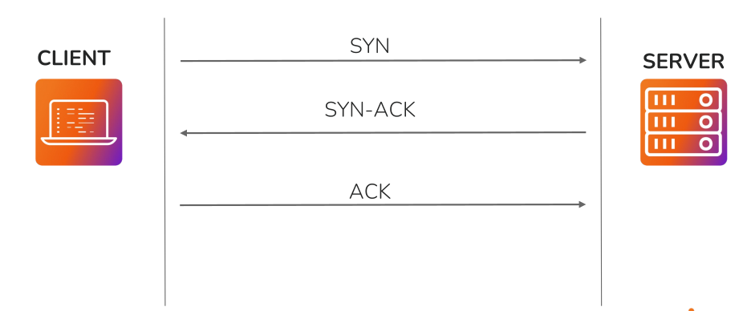
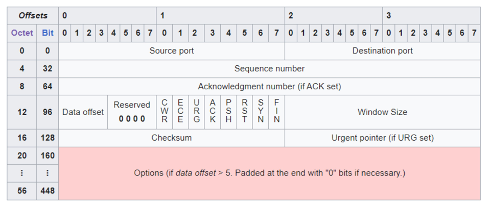

&nbsp;

# Transport Layer (OSI Layer 4)

The **Transport Layer** is the **fourth layer of the OSI (Open Systems Interconnection) model**. It is responsible for providing ==**end-to-end communication**== between devices over a network.

Its primary functions include:

- Reliable data transmission
    
- Error detection and recovery
    
- Flow control
    
- Data segmentation and reassembly
    

* * *

# Transport Layer Protocols

The Transport Layer mainly uses two protocols:

## 1\. TCP (Transmission Control Protocol)

TCP is a **connection-oriented** protocol that provides **reliable and ordered** data delivery.

### Key Features

### • Connection-Oriented

- Establishes a connection between the sender and receiver before transmitting data.
    
- Uses a **virtual connection** to ensure reliable communication.
    

### • Reliable Delivery

- Guarantees that all data reaches the destination.
    
- Uses **Acknowledgments (ACKs)** and **retransmission** to recover lost or corrupted packets.
    

### • Ordered Data Transfer

- Ensures data is delivered in the same order it was sent.
    
- If packets arrive out of sequence, TCP reorders them before passing them to the application.
    

* * *

## 2\. UDP (User Datagram Protocol)

UDP is a **connectionless** protocol designed for **fast data transmission**.

### Key Features

- Does **not establish a connection** before sending data.
    
- Does **not guarantee** delivery.
    
- Does **not guarantee** packet order.
    
- Does **not retransmit** lost packets.
    
- Has lower overhead than TCP, making it faster.
    

* * *

# TCP vs UDP

| Feature | TCP | UDP |
| --- | --- | --- |
| Connection | Connection-Oriented | Connectionless |
| Reliability | Reliable | Unreliable |
| Packet Order | Guaranteed | Not Guaranteed |
| Error Recovery | Yes | No  |
| Speed | Slower | Faster |
| Overhead | Higher | Lower |
| Common Uses | HTTP, HTTPS, SSH, FTP, SMTP | DNS, DHCP, VoIP, Video Streaming, Online Gaming |

&nbsp;

### Step 1: SYN (Synchronize)

- The **client** sends a **SYN** packet to the server.
    
- It means:
    
    > "I want to establish a connection."
    

* * *

### Step 2: SYN-ACK (Synchronize + Acknowledge)

- The **server** replies with a **SYN-ACK** packet.
    
- It means:
    
    > "I received your request, and I'm ready to communicate."
    

* * *

### Step 3: ACK (Acknowledge)

- The **client** sends an **ACK** packet back to the server.
    
- It means:
    
    > "I received your reply. The connection is established."
    

After this step, both the client and server can exchange data reliably.

&nbsp;

# TCP HEADER FIELDS

# TCP Port Numbers

TCP uses **port numbers** to identify different **services or applications** running on a device.

### Key Points

- Port numbers are **16-bit unsigned integers**.
- They range from **0 to 65,535**.
- They allow multiple applications to communicate simultaneously on the same device.

| Port Range | Name | Usage |
| --- | --- | --- |
| **0 – 1023** | Well-Known Ports | Standard services (HTTP, HTTPS, SSH, FTP, SMTP, etc.) |
| **1024 – 49151** | Registered Ports | Applications and software (RDP, MySQL, MongoDB, etc.) |
| **49152 – 65535** | Dynamic / Private Ports | Temporary client-side ports assigned automatically |

&nbsp;

# TCP Control Flags

TCP uses **control flags** to establish, maintain, and terminate connections between a client and a server.

The three primary flags are:

- **SYN (Synchronize)** – Initiates a connection.
- **ACK (Acknowledgment)** – Confirms receipt of data or connection requests.
- **FIN (Finish)** – Terminates a connection.

* * *

# 1\. Establishing a Connection (Client → Server)

The client sends a **SYN** packet to request a connection.

| Flag | Status | Purpose |
| --- | --- | --- |
| **SYN** | Set (1) | Requests a new connection |
| **ACK** | Clear (0) | No acknowledgment yet |
| **FIN** | Clear (0) | No connection termination request |

**Meaning:**

> "I want to establish a connection."

* * *

# 2\. Establishing a Connection (Server → Client)

The server responds with a **SYN-ACK** packet.

| Flag | Status | Purpose |
| --- | --- | --- |
| **SYN** | Set (1) | Accepts the connection request |
| **ACK** | Set (1) | Acknowledges the client's SYN |
| **FIN** | Clear (0) | No connection termination request |

**Meaning:**

> "I received your request and I'm ready to communicate."

* * *

# 3\. Connection Termination

When communication is complete, one device sends a **FIN** packet.

| Flag | Status | Purpose |
| --- | --- | --- |
| **SYN** | Clear (0) | No new connection request |
| **ACK** | Set (1) | Acknowledges previous data |
| **FIN** | Set (1) | Requests to terminate the connection |

**Meaning:**

> "I'm finished communicating. Let's close the connection."

&nbsp;

# UDP

- Udp is connection-less light weight transport layer protocol taht provides a simple and minimalistic way to transmit data between devices.
- udp does not establish a connection before sending data to the devices and also does not provides realibility and order gaurantee of packets .