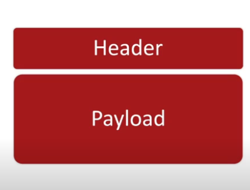
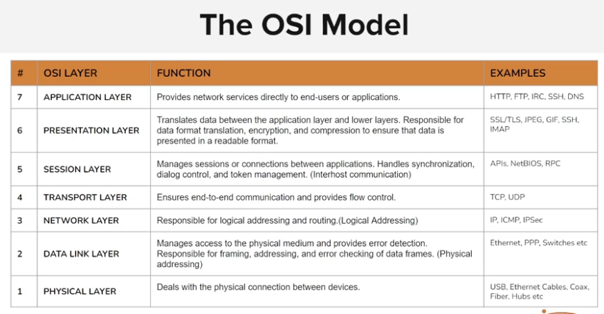

### every packet in every protocol has this structure

&nbsp;

generalised view of packet

┌────────────────────┐  
│ Ethernet Header │ ← MAC addresses(datalink layer)  
├────────────────────┤  
│ IP Header │ ← Source/Destination IP, TTL, Protocol (network layer)  
├────────────────────┤  
│ TCP Header │ ← Ports, Sequence Number, Flags (Transport layer)  
├────────────────────┤  
│ Payload │ ← HTTP request, DNS query, file data, etc. (application layer )   
└────────────────────┘

detailed description about OSI layer

