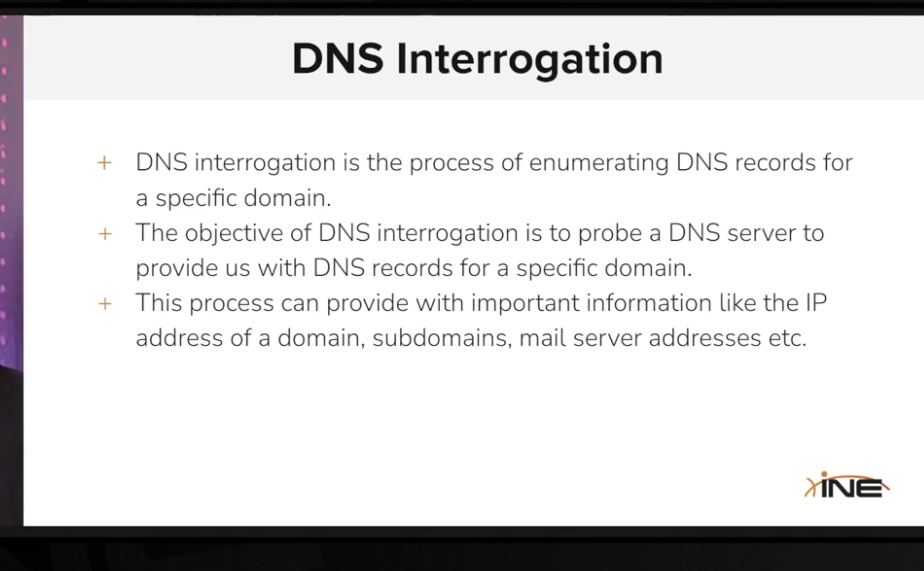
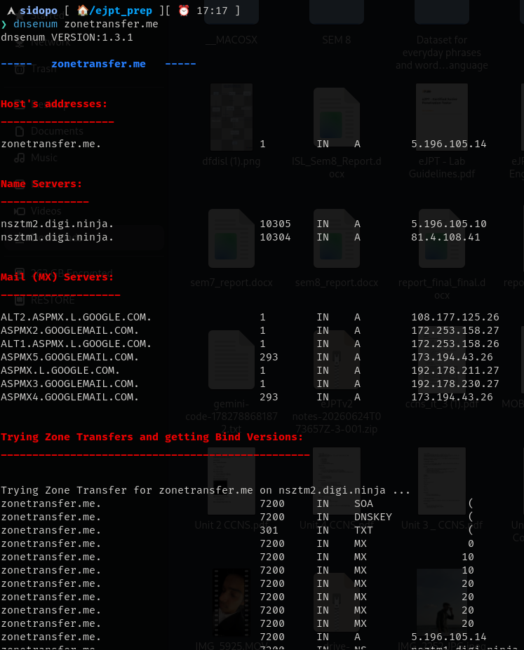
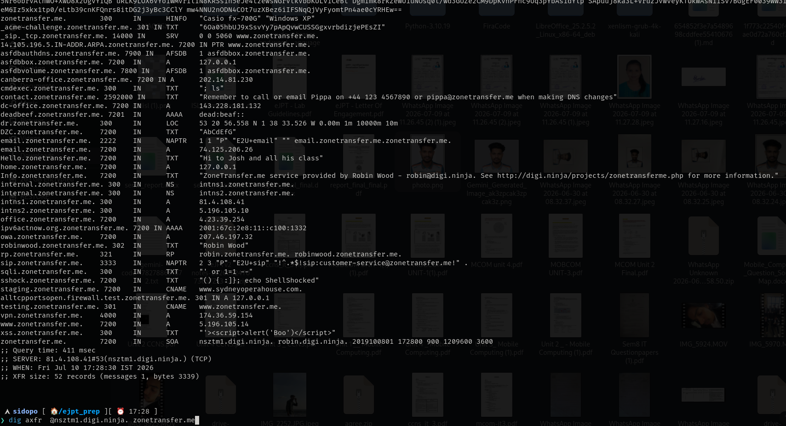

dns zone transfer using dnsenum tool,the domains host or subdomains can be listed from local(internal) network and can be very usefull during enumerations

dig tools also be can be used to enumerate a name server 

