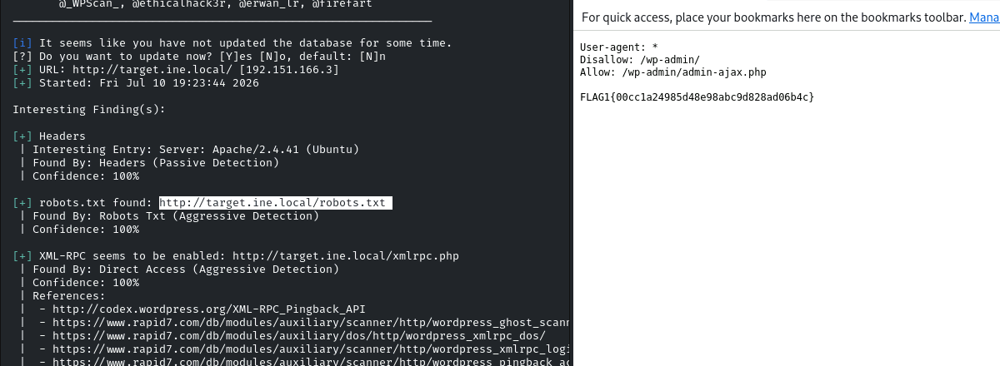
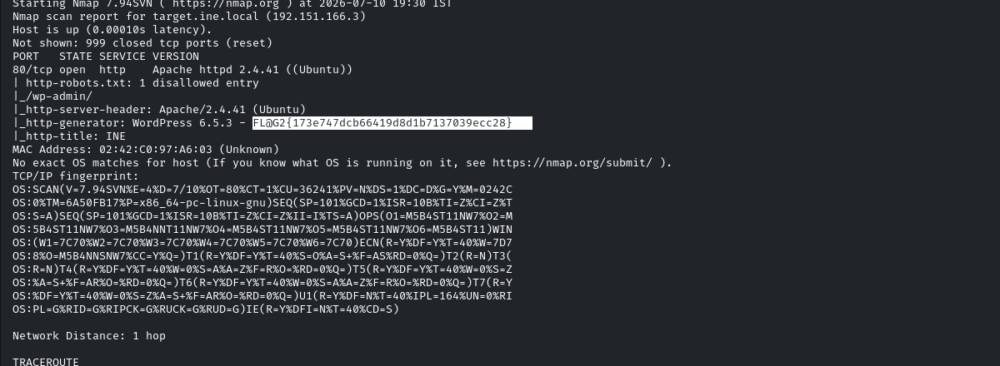
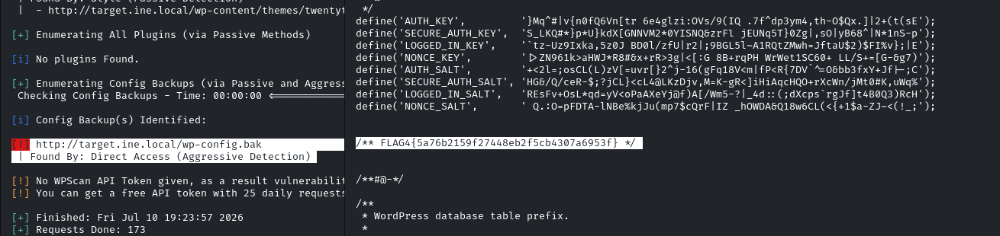
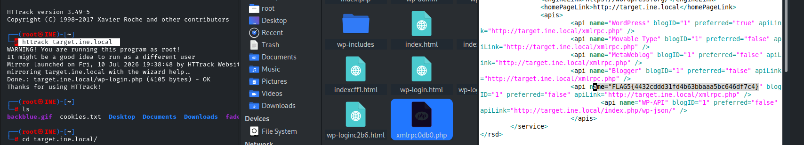

### flag 1:This tells search engines what to and what not to avoid.

### flag2: What website is running on the target, and what is its version?

### flag3: Directory browsing might reveal where files are stored.



flag4: An overlooked backup file in the webroot can be problematic if it reveals sensitive configuration details.

&nbsp;

flag5: Certain files may reveal something interesting when mirrored.

