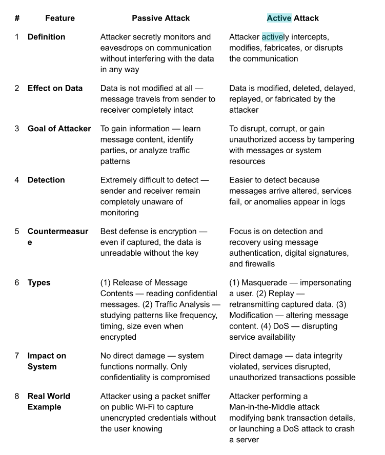

information about the users is critical ,with the employees information we can perform a bruteforce attack or a phishing attack to get the credentials or attach malicious files to the email to get access to the internal network 

more the information we have about the the more we can be successfull for during the penetration testing or during  enumeration.

==active information gathering== \-gathering information from the target by actually engaging with the target ,an example could be using a port scanner to identify the open ports and the services running on this ports ,,tools can be used such as nmap ,tagets may come to know about the attacks if a IDS is installed on the network 

==passive information gathering==\-collecting information about the target through publicily open information or by without actually interacting with the targets,using google or any social media of blogs sites to collect information about the target ,the attacks are stealth are only the attacker is known about the attack ,target is never aware of the attacks 

&nbsp;