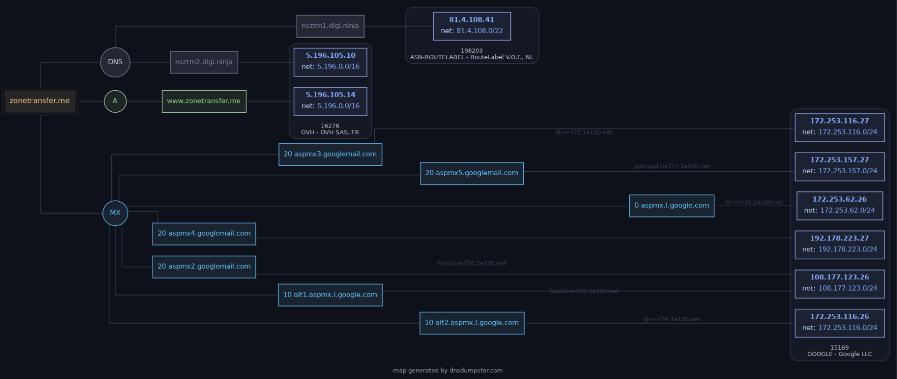

dnsrecon -d example.com --preinstalled tool used to identify the different NS MX corresponding to a domain

dnssumbster website can used for the same

- **A** → Where the website is hosted (IPv4).
- **AAAA** → Whether the site supports IPv6.
- **MX** → Which server handles email (potential target for mail-related assessments).
- **NS** → Which DNS provider manages the domain.
- **TXT** → Email policies, verification tokens, and other metadata.
- **SOA** → Administrative details about the DNS zone.

| Record | Remember it as | What it stores |
| --- | --- | --- |
| **A** | **Address** | IPv4 address |
| **AAAA** | **Address (IPv6)** | IPv6 address |
| **MX** | **Mail** | Mail server |
| **NS** | **Name Server** | Authoritative DNS servers |
| **TXT** | **Text** | Verification and security policies |
| **SOA** | **Start of Authority** | DNS zone administration |

| Record Type | Full Name | Description | Zone File Example |
| --- | --- | --- | --- |
| `A` | Address Record | Maps a hostname to its IPv4 address. | `www.example.com.` IN A `192.0.2.1` |
| `AAAA` | IPv6 Address Record | Maps a hostname to its IPv6 address. | `www.example.com.` IN AAAA `2001:db8:85a3::8a2e:370:7334` |
| `CNAME` | Canonical Name Record | Creates an alias for a hostname, pointing it to another hostname. | `blog.example.com.` IN CNAME `webserver.example.net.` |
| `MX` | Mail Exchange Record | Specifies the mail server(s) responsible for handling email for the domain. | `example.com.` IN MX 10 `mail.example.com.` |
| `NS` | Name Server Record | Delegates a DNS zone to a specific authoritative name server. | `example.com.` IN NS `ns1.example.com.` |
| `TXT` | Text Record | Stores arbitrary text information, often used for domain verification or security policies. | `example.com.` IN TXT `"v=spf1 mx -all"` (SPF record) |
| `SOA` | Start of Authority Record | Specifies administrative information about a DNS zone, including the primary name server, responsible person's email, and other parameters. | `example.com.` IN SOA `ns1.example.com. admin.example.com. 2024060301 10800 3600 604800 86400` |
| `SRV` | Service Record | Defines the hostname and port number for specific services. | `_sip._udp.example.com.` IN SRV 10 5 5060 `sipserver.example.com.` |
| `PTR` | Pointer Record | Used for reverse DNS lookups, mapping an IP address to a hostname. | `1.2.0.192.in-addr.arpa.` IN PTR `www.example.com.` |

&nbsp;

an example of dnsdumpster.com for the host zonetransfer.me

