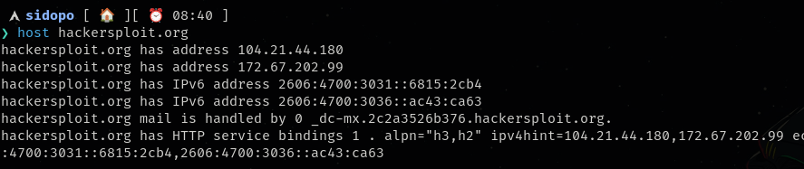

## ==host== command is used to find the ip address of the website ,a website may be hidden behind a proxy server

more than 1 ip address in the output indicates the website is hidden under a firewall or a proxy server



&nbsp;

# the second recon method is to find any access the robots.txt file on the website that describes whether the search engine is allowed to crawl the website or not (allowed to index a directory or not)

### How robots.txt affects crawling

Suppose a website has:

```
User-agent: *
Disallow: /admin/
Disallow: /private/
```

### Explanation

- `User-agent: *`
    - Applies the rules to all search engine bots.
- `Disallow: /admin/`
    - Tells bots not to crawl the `/admin/` directory.
- `Disallow: /private/`
    - Prevents crawling of the `/private/` directory.
- `Allow: /`
    - Allows crawling of the rest of the website.
- `Sitemap:`
    - Specifies the location of the website's sitemap.

The crawler behaves like this:

```
Website
│
├── Home         ✅ Crawl
├── About        ✅ Crawl
├── Blog         ✅ Crawl
├── Admin        ❌ Skip
└── Private      ❌ Skip
```

A well-behaved crawler sees the `robots.txt` file first and avoids the disallowed paths.{crawler means bots like google bots }

&nbsp;

&nbsp;

### ==a search engine never go through all the web pages when a user searches for specific keywords,==

### ==the google crawls websites and stores their data or index them {header ,keywords,url} in a massive database==

### ==so whenever a user search for something the search engine only looks inside the indexed database==

&nbsp;

## **sitemap.xml file**

A **`sitemap.xml`** file is an XML document that lists the important URLs of a website. It helps search engines discover pages more efficiently.

Unlike `robots.txt`, which says **"don't crawl these pages"**, a sitemap says **"here are the pages I want you to know about."**

A sitemap typically includes pages like:

/  
├── /about  
├── /contact  
├── /products  
├── /blog  
├── /blog/post1  
├── /blog/post2  
├── /services  
└── /pricing

&nbsp;

## **Identifying technologies behind a website**

**buitwith/wapalyzer  extension on mozilla firefox**

**using whatweb tool can help you provide sufficient inormation**

&nbsp;

**Downloading the whole website using webhttrack tool**