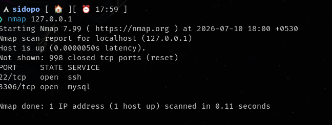
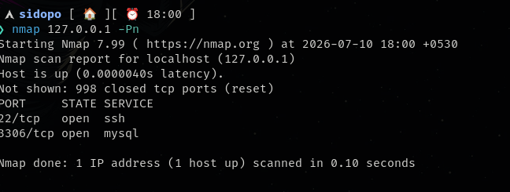
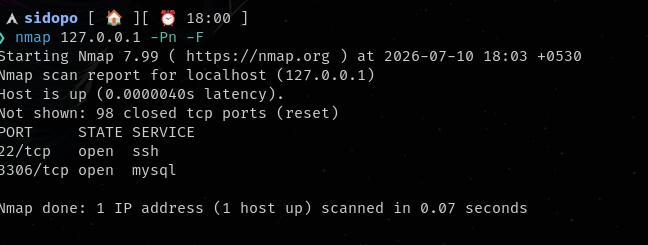
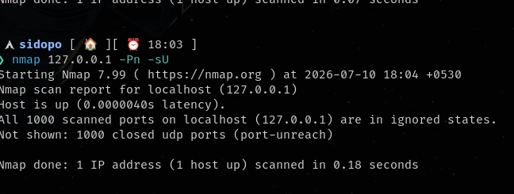
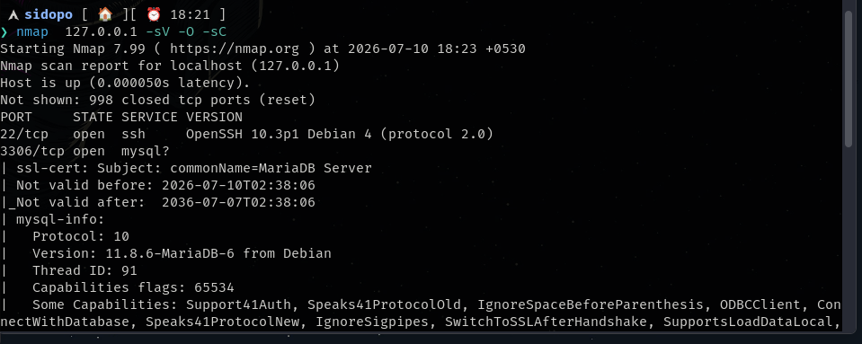
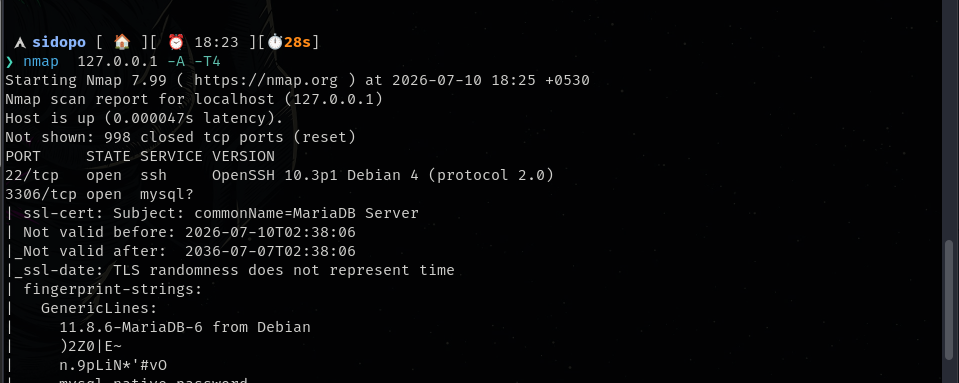
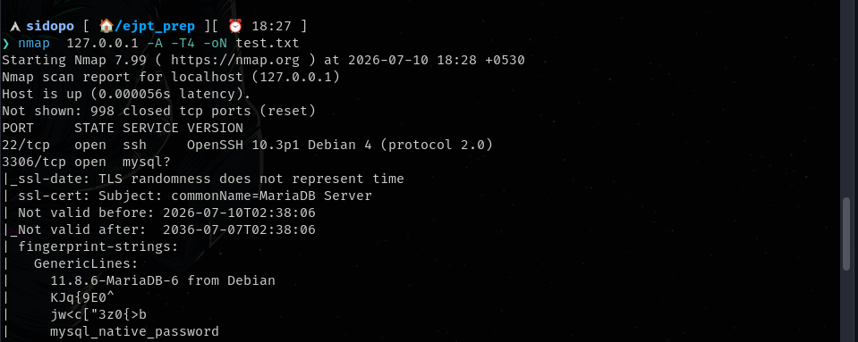

default scan for 1024 ports

consider all host as up ,skip host discvery

fast scan

udp scan

the above scan can be combined into a single option -A {-sV -O -sC} all 3 are combined in a single scan

&nbsp;

timing option scan  **-T paranoid|sneaky|polite|normal|aggressive|insane ,T0T1,T2,T3,T4,T5**

&nbsp;

exporting the scan to a file test.txt

